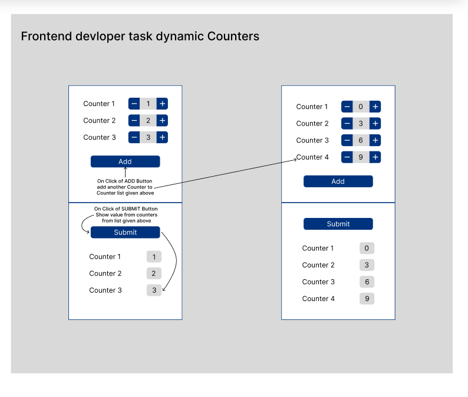

# f.io take home

My Frontend take home submission for the prompt below:

## Getting Started

These instructions will get you a copy of the project up and running on your local machine for development and testing purposes.

### Prerequisite

- Node
- Npm

### Installing

1. Fork this repository on Github.
2. Clone your forked repository onto your local computer.
3. Use `$ cd f.io-take-home` to move into the project directory.
4. Use `$ npm i` to install the required dependencies.
5. Use `$ npm run dev` to spin up the local development server.
6. Visit `http://localhost:5173/` on your browser to view the application.
